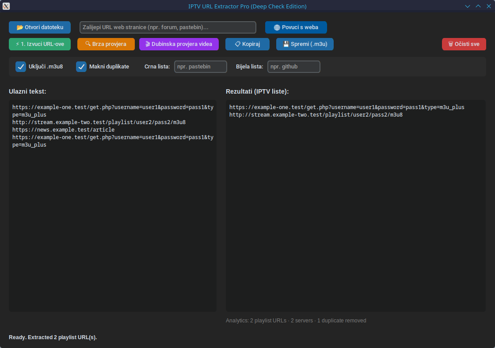

# IPTV URL Extractor Pro

[English](#english) | [Hrvatski](#hrvatski)

## English

Desktop application for finding IPTV playlist URLs (`.m3u` and `.m3u8`) in
text, local files, and web content.

## Screenshot

### Main window



### Features

- opens local text files
- downloads text from an entered web address
- finds HTTP and HTTPS URLs
- extracts `.m3u` and `.m3u8` links
- detects `m3u` in URL query parameters
- removes duplicates
- supports blacklist and whitelist filters
- shows the most common discovered servers
- quickly checks whether playlist URLs respond
- deeply checks whether video stream content can be reached
- checks multiple links in parallel
- copies results to clipboard
- saves results as `.m3u` or `.txt`

The application accesses the internet when downloading a web page and when
checking links.

### Requirements

- Python 3.8 or newer
- Tkinter
- `customtkinter`
- `requests`

On Debian/Ubuntu systems, install Tkinter if needed:

```bash
sudo apt install python3-tk
```

Install Python packages:

```bash
python3 -m pip install -r requirements.txt
```

### Running

Linux:

```bash
./run_pro_linux.sh
```

Windows:

```bat
run_pro_windows.bat
```

Or run the Python file directly:

```bash
python3 iptv_url_extractor_pro.py
```

### Creating native executables

Windows `.exe` and Linux executables must be built separately on their own
operating systems.

Windows build:

```bat
py -3 -m pip install pyinstaller -r requirements.txt
py -3 -m PyInstaller --noconfirm --onefile --windowed --name IPTV-URL-Extractor-Pro --collect-all customtkinter iptv_url_extractor_pro.py
```

Linux build:

```bash
python3 -m pip install pyinstaller -r requirements.txt
python3 -m PyInstaller --noconfirm --onefile --windowed --name IPTV-URL-Extractor-Pro --collect-all customtkinter iptv_url_extractor_pro.py
```

The output will be created in the `dist/` folder.

### Note

The program uses heuristics. A discovered link is not necessarily valid, active,
or accessible. Use this program only with content and systems you are authorized
to access.

## Hrvatski

Desktop aplikacija za pronalaženje IPTV playlist URL-ova (`.m3u` i `.m3u8`) u
tekstu, lokalnim datotekama i web-sadržaju.

### Mogućnosti

- otvara lokalne tekstualne datoteke
- preuzima tekst s unesene web-adrese
- pronalazi HTTP i HTTPS URL-ove
- izdvaja `.m3u` i `.m3u8` poveznice
- prepoznaje `m3u` u parametrima URL-a
- uklanja duplikate
- podržava crnu i bijelu listu pojmova
- prikazuje najčešće pronađene servere
- brzo provjerava odgovaraju li playlist URL-ovi
- dubinski provjerava može li se dohvatiti sadržaj video-streama
- paralelno provjerava više poveznica
- kopira rezultate u clipboard
- sprema rezultate kao `.m3u` ili `.txt`

Aplikacija pristupa internetu pri preuzimanju stranice i provjeri poveznica.

### Zahtjevi

- Python 3.8 ili noviji
- Tkinter
- `customtkinter`
- `requests`

Na Debian/Ubuntu sustavima Tkinter se po potrebi instalira naredbom:

```bash
sudo apt install python3-tk
```

Python paketi:

```bash
python3 -m pip install -r requirements.txt
```

### Pokretanje

Linux:

```bash
./run_pro_linux.sh
```

Windows:

```bat
run_pro_windows.bat
```

Ili direktno pokreni Python datoteku:

```bash
python3 iptv_url_extractor_pro.py
```

### Izrada nativne izvršne datoteke

Windows `.exe` i Linux izvršna datoteka moraju se graditi odvojeno na svojem
operacijskom sustavu.

Windows build:

```bat
py -3 -m pip install pyinstaller -r requirements.txt
py -3 -m PyInstaller --noconfirm --onefile --windowed --name IPTV-URL-Extractor-Pro --collect-all customtkinter iptv_url_extractor_pro.py
```

Linux build:

```bash
python3 -m pip install pyinstaller -r requirements.txt
python3 -m PyInstaller --noconfirm --onefile --windowed --name IPTV-URL-Extractor-Pro --collect-all customtkinter iptv_url_extractor_pro.py
```

Rezultat se nalazi u mapi `dist/`.

### Napomena

Program koristi heuristiku. Pronađena poveznica nije nužno ispravna, aktivna
ili dostupna. Koristi ovaj program samo sa sadržajem i sustavima za koje imaš
dozvolu pristupa.
